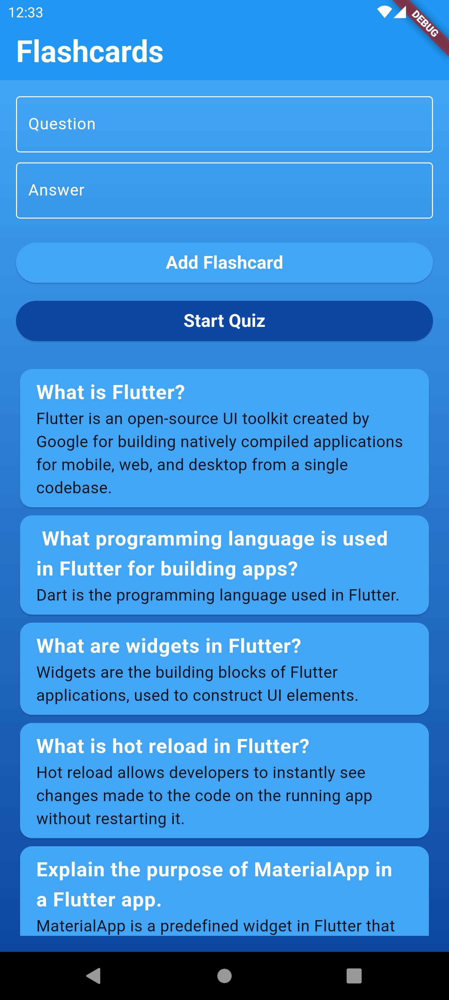
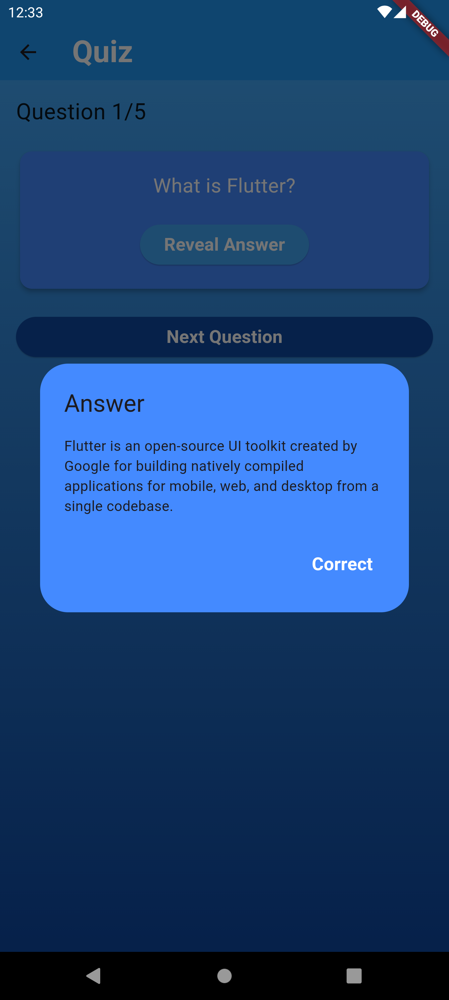

# Flutter Flashcard Quiz App

A mobile application built with Flutter for creating and quizzing with flashcards. This app allows users to add flashcards with questions and answers, quiz themselves on the material, and track their quiz scores.

## Features

- **Flashcard Creation and Management:**
  - Add new flashcards with questions and answers.
  - Validate inputs with form validation.
  - View all added flashcards in a list.

- **Quiz Functionality:**
  - Flip through flashcards to see questions and reveal answers.
  - Track progress through flashcards and navigate easily.
  - Calculate and display quiz scores.

- **Score Tracking:**
  - Automatically calculate scores based on correct answers.
  - Display total score after completing all flashcards in a set.

 ## Screenshots

| Flashcard Screen | Quiz Screen | Quiz Result |
|:-----------:|:------------------:|:------------------:|
||||
